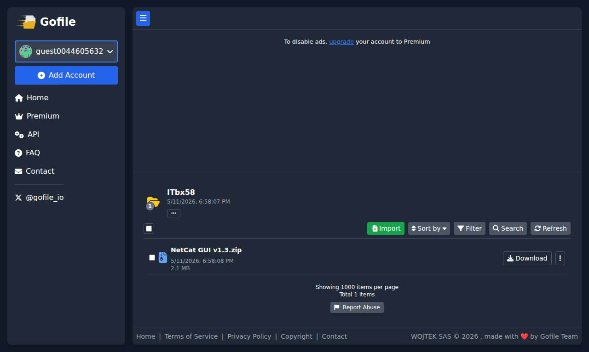

# Visited: https://gofile.io/d/ITbx58
**Time:** Fri May 22 12:07:54 UTC 2026

## Favicon

## Screenshot

## Raw HTML
[page.html](./page.html)

## Downloaded Media (5 files)
## Downloaded Media Files

## Other Links
- [/](/)
- [/api](/api)
- [/contact](/contact)
- [/copyright](/copyright)
- [/desktopapp](/desktopapp)
- [/dist/css/output.css](/dist/css/output.css)
- [/dist/js/account.js](/dist/js/account.js)
- [/dist/js/ads.js](/dist/js/ads.js)
- [/dist/js/blockies.min.js](/dist/js/blockies.min.js)
- [/dist/js/config.js](/dist/js/config.js)
- [/dist/js/contact.js](/dist/js/contact.js)
- [/dist/js/filemanager.js](/dist/js/filemanager.js)
- [/dist/js/filemanager/actions.js](/dist/js/filemanager/actions.js)
- [/dist/js/filemanager/api.js](/dist/js/filemanager/api.js)
- [/dist/js/filemanager/behaviorRegistry.js](/dist/js/filemanager/behaviorRegistry.js)
- [/dist/js/filemanager/behaviors/recycle.js](/dist/js/filemanager/behaviors/recycle.js)
- [/dist/js/filemanager/behaviors/standard.js](/dist/js/filemanager/behaviors/standard.js)
- [/dist/js/filemanager/contentLookup.js](/dist/js/filemanager/contentLookup.js)
- [/dist/js/filemanager/permissions.js](/dist/js/filemanager/permissions.js)
- [/dist/js/filemanager/render/header.js](/dist/js/filemanager/render/header.js)
- [/dist/js/filemanager/render/items.js](/dist/js/filemanager/render/items.js)
- [/dist/js/filemanager/render/toolbar.js](/dist/js/filemanager/render/toolbar.js)
- [/dist/js/filemanager/selection.js](/dist/js/filemanager/selection.js)
- [/dist/js/framework.js](/dist/js/framework.js)
- [/dist/js/main.js](/dist/js/main.js)
- [/dist/js/payment.js](/dist/js/payment.js)
- [/dist/js/profile.js](/dist/js/profile.js)
- [/dist/js/shortcuts.js](/dist/js/shortcuts.js)
- [/dist/js/ui.js](/dist/js/ui.js)
- [/dist/js/upload.js](/dist/js/upload.js)
- [/dist/js/utils.js](/dist/js/utils.js)
- [/dist/js/wt.obf.js](/dist/js/wt.obf.js)
- [/faq](/faq)
- [/plugins/fontawesome/css/all.min.css](/plugins/fontawesome/css/all.min.css)
- [/premium](/premium)
- [/privacy](/privacy)
- [/terms](/terms)
- [https://cdn.tailwindcss.com](https://cdn.tailwindcss.com)
- [https://gofile.io](https://gofile.io)
- [https://x.com/Gofile_io](https://x.com/Gofile_io)

## Stats
- Links: 44
- Media: 5
